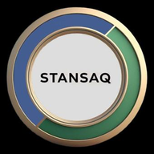

  

<h1 align="center">Stansaq F.Z.C. — Corporate Website</h1>

  Industrial materials representation, presented the way an established
  European engineering company presents itself — not a tech startup.

---

## About

Stansaq F.Z.C. is a Sharjah-based representation and market-development
company for specialist polymer, elastomer, and industrial materials
manufacturers across the Middle East. This repository is the company's
public website: a Swiss-grid, minimalist corporate site with a live-editable
catalog of the principal manufacturers Stansaq represents and the products
supplied through them.

The design deliberately avoids the visual language of AI-generated startup
sites — no gradients, no glassmorphism, no floating cards, no oversized
rounded corners. Industrial-drawing details (section markers, spec-sheet
tables, drafting-style image placeholders) carry the visual identity instead.

## Features

- **Seven-page public site** — Home, About, Solutions, Industries, Principal
  Partners, Insights, and Contact, each built around real technical
  copywriting rather than placeholder text.
- **Live-editable Principal Partners & Products** — an authenticated admin
  dashboard lets non-technical staff add a manufacturer or product (name,
  description, logo/image, linked company) and see it appear on the public
  site immediately. No code changes, no redeploy.
- **Motion with restraint** — scroll-triggered reveals, an animated partner
  ticker, and a cursor-tracked crosshair on the hero image, all built to
  stay within the site's industrial-drawing visual language rather than
  read as generic template animation.
- **Hardened by default** — see [Security](#security) below.

## Tech stack

| Layer | Choice |
|---|---|
| Server | Node.js / Express |
| Database & file storage | Supabase (Postgres + Storage) |
| Frontend | Vanilla HTML / CSS / JS — no framework, no build step |
| Hosting | Render (or any Node-capable host — see `SETUP.md`) |
| Auth | Session-based, `bcrypt`-hashed single admin account |

## Pages

| Page | What's there |
|---|---|
| Home | Hero, partner ticker, industries served, solutions overview, engineering process timeline, latest insights |
| About | Mission, vision, company story, founder background |
| Solutions | Eight product/equipment categories: Polyurethane Systems, Industrial Films, Medical Films, Protective Films, Pipe Relining, Processing Equipment, Passport Hinge Materials, Packaging Materials |
| Industries | Eight sectors served, cross-referenced against the Solutions categories |
| Principal Partners | Live-loaded from the database — company profiles with logo, description, applications, and linked products |
| Insights | Categorized technical articles with a sample full article page |
| Contact | Enquiry form, office details, map |

## Security

This isn't a brochure site with an afterthought login bolted on. Specific
measures in place:

- **Password hashing** via `bcrypt`, never plaintext.
- **Rate-limited login** (10 attempts / 15 minutes per IP) against brute force.
- **CSRF defense in depth** — `SameSite=strict` session cookies plus explicit
  Origin-header verification on every state-changing admin request.
- **Content Security Policy** via Helmet, with a genuinely strict
  `script-src 'self'` (every script lives in an external file — zero inline
  `<script>` tags anywhere in the codebase, specifically so this policy can
  be strict rather than symbolic).
- **Upload verification by content, not extension** — image uploads are
  checked against their actual binary signature (magic bytes), not the
  filename or client-supplied MIME type, which an attacker fully controls.
  SVG uploads are scanned for embedded scripts and event handlers before
  they're accepted.
- **Row Level Security** on every Supabase table, with zero policies for the
  public `anon` key — only the server's `service_role` key (never exposed to
  a browser) can read or write partner/product data at all.
- **No stack traces to the public** — database errors are logged server-side
  and returned to visitors as a generic message, never the raw error detail.

Full details, plus the reasoning behind each choice, are in the Ops Runbook.

## Documentation

| Document | For |
|---|---|
| `Stansaq-Website-Setup-Guide.pdf` | Setup only — Supabase, hosting, domain, admin usage |
| `Stansaq-Ops-Runbook.pdf` | The complete manual — setup through Supabase/Render, admin usage, monitoring, incident response, security, key rotation, and backups, all in one document |

## Screenshots

_Once the site is live, drop screenshots here (e.g. `docs/screenshots/home.png`,
`docs/screenshots/partners.png`, `docs/screenshots/admin.png`) and reference
them below — left as a placeholder rather than faked, since this repo was
assembled before a live deployment existed to screenshot._

## License

Proprietary — © Stansaq F.Z.C. Not licensed for reuse.
